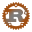
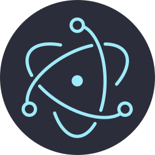

### Hi there 👋

I'm a full-stack developer specialized in Javascript and web technologies with a low-level technical background, and a keen intereset in cybersecurity. Here are some open-sourced projects that I've worked on:

#### 🎮 Emulators

WebAssembly emulators playable in the browser. Try them out [online](https://lucien.le-roux.dev/retro)!

- [Online WASM console emulators](https://github.com/kabukki/retro) (2021) 
- [NES emulator](https://github.com/kabukki/wasm-nes) (2021)   
- [CHIP-8 emulator](https://github.com/kabukki/wasm-chip8) (2021)   
- *More to come: GameBoy, Nintendo 64, PlayStation...*

#### 🛠 Tools & Productivity

Libraries and apps to improve productivity and reuse code.

- [Hacking toolkit](https://github.com/kabukki/hackit) (2021) 
- [Epitech scripts](https://github.com/kabukki/epitech-utils) (2018) 
- [Desktop client for Epitech repository management](https://github.com/kabukki/blih-vue) (2018)  
- [Node.js client for Epitech repository management](https://github.com/kabukki/blih) (2017) 
- [Electron project scaffolder](https://github.com/kabukki/yarvis) (2017)  
- [CLI project scaffolder](https://github.com/kabukki/yarvis-cli) (2017) 
- [Linked list manipulation library](https://github.com/kabukki/c-list) (2017) 
- [Matrix manipulation library](https://github.com/kabukki/c-matrix) (2016) 

#### 📚 Educational

Some school projects worth sharing.

- ["Des chiffres et des lettres" solver](https://github.com/kabukki/uqar-renardeau) (2019) 
- [Password cracker](https://github.com/kabukki/uqar-password-cracker) (2019) 
- [FTP client & server](https://github.com/kabukki/epitech-ftp) (2018) 
- [x86 standard C library implementation](https://github.com/kabukki/asm-libc) (2017) 

#### 🎲 Miscellaneous

- [Brainfuck interpreter](https://github.com/kabukki/brainfuck) (2022) 
- [Geography quiz](https://github.com/kabukki/geo) (2022) 
- [Vue component library](https://github.com/kabukki/vue-components) (2019) 
- [PWA soundbox](https://github.com/kabukki/khrissbox) (2018) 
- [3D collision detection script for Montecrypto game](https://gist.github.com/kabukki/66f19b9752a6725e625a81157a66edfa) plotted [online](https://chart-studio.plotly.com/~rshn.kabu/1/#/) (2018) 
- [IP address optimizer](https://github.com/kabukki/ip-optimizer) (2017) 
- [Zelda BOTW cooking simulator](https://github.com/kabukki/zelda-cooking) (2017) 
- [Multiplayer Yahtzee game](https://github.com/kabukki/yahtzee) (2016) 
- [CLI quiz game](https://github.com/kabukki/membash) (2016) 

Other experimental or unfinished projects are not mentioned here.

> Icons from https://github.com/vscode-icons/vscode-icons

<!--
**kabukki/kabukki** is a ✨ _special_ ✨ repository because its `README.md` (this file) appears on your GitHub profile.

Here are some ideas to get you started:

- 🔭 I’m currently working on ...
- 🌱 I’m currently learning ...
- 👯 I’m looking to collaborate on ...
- 🤔 I’m looking for help with ...
- 💬 Ask me about ...
- 📫 How to reach me: ...
- 😄 Pronouns: ...
- ⚡ Fun fact: ...
-->
